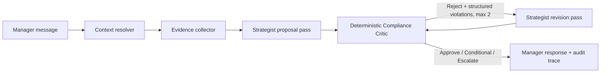

# Driver Retention Copilot

A production-minded take-home implementation of an auditable **Strategist / Compliance Critic**
workflow for Driver Relationship Managers.

The system retrieves structured driver data, support-ticket evidence, eligible incentive candidates,
and relevant policy clauses; proposes a retention strategy; validates that strategy with independent
deterministic guardrails; and performs a bounded self-correction pass when the Critic rejects the
proposal.

> **Safety boundary:** this repository produces recommendations only. It does not issue incentives,
> transfer money, or mutate a driver's account.

## Architecture



This is a **hybrid multi-agent system**:

- The **Strategist** is a plan-generation agent. It can run as an offline deterministic implementation
  or as an optional schema-constrained LLM.
- The **Compliance Critic** is an independently implemented validation agent. It does not need an LLM
  prompt because financial caps, eligibility, stacking, missing-data handling, and escalation rules are
  safer and more auditable as deterministic policy-as-code.
- When the Critic rejects a proposal, its structured violations are passed into a separate Strategist
  revision step. The revised plan is validated again before it can be presented as compliant.

Agent roles are defined by their responsibilities and contracts, not by requiring a separate language
model for every role. The LLM, when enabled, may **propose and revise**; it is never the authority for
financial or eligibility decisions.

## Highlights

- Clear Actor/Validator separation with a bounded self-correction loop.
- Deterministic Compliance Critic with stable rule IDs and structured violation feedback.
- Policy RAG using heading-aware clauses, metadata filters, lexical ranking, and mandatory global
  guardrail injection.
- Exact driver, ticket, ledger, and incentive retrieval rather than embedding structured records.
- Defensive integration of the supplied Incentive Service mock.
- Persistent SQLite conversation state for multi-turn follow-up questions.
- Fail-closed behaviour when monthly spend or 24-hour credit history is unavailable.
- Explicit handling of the supplied catalogue/policy mismatch: `INC-001` is £25 in the mock, while
  Silver/Bronze airport recovery is capped at £15.
- Optional OpenAI structured-output Strategist with bounded retries and deterministic offline fallback.
- Free, human-mediated LLM testing mode that exercises the real prompt and revision contracts without
  requiring a paid API key.
- FastAPI, Typer CLI, optional Streamlit UI, Docker, CI, security checks, and documented Git workflow.
- **81 automated tests** covering domain rules, edge cases, tools, orchestration, memory, API contracts,
  LLM fallback, manual testing, evaluation artifacts, and failure modes.
- Latest local validation:
  - Ruff: all checks passed.
  - mypy: no issues found in 37 source files.
  - Bandit: no issues identified.
  - pytest: 81 passed.
  - branch-aware coverage: 86.61%, above the enforced 85% threshold.

## Execution modes

The same orchestration and deterministic compliance boundary are available in three modes.

### 1. Offline heuristic mode

This is the default and requires no API key:

```dotenv
STRATEGIST_PROVIDER=heuristic
```

It is fully reproducible and suitable for reviewers running the project locally.

### 2. API-backed LLM mode

Install the optional AI dependency and configure an available OpenAI model:

```bash
python -m pip install -e ".[ai]"
export STRATEGIST_PROVIDER=openai
export OPENAI_API_KEY=...
export OPENAI_MODEL=<model-available-to-your-account>
```

No model name is hard-coded because model access is deployment-specific. The external response must
validate as a typed `RetentionPlan`; all policy checks still execute locally.

### 3. No-cost manual LLM mode

The repository can export the exact grounded prompt used by the LLM Strategist, accept JSON copied
from a chat model, validate it against the Pydantic schema, and run the deterministic Critic. Rejected
plans produce a new revision prompt containing the Critic's structured feedback.

## Quick start

```bash
python -m venv .venv
source .venv/bin/activate          # Windows: .venv\Scripts\activate
python -m pip install --upgrade pip
python -m pip install -e ".[dev,pdf]"
cp .env.example .env
make test
make demo
```

For the validated Linux/Python 3.13 dependency set:

```bash
make install-locked
```

## Run the API

```bash
make api
curl -s http://localhost:8000/health
curl -s -X POST http://localhost:8000/v1/chat \
  -H 'content-type: application/json' \
  -d '{
    "driver_id": "D-LON-001",
    "message": "Maria waited 135 minutes for a 1.5km airport trip. What should we do?"
  }'
```

## Run the CLI

```bash
python -m app.cli chat \
  --driver-id D-LON-001 \
  --message "Maria waited 135 minutes for a 1.5km airport trip. What should we do?"
```

## Run the optional UI

```bash
python -m pip install -e ".[ui]"
streamlit run app/ui/streamlit_app.py
```

## Required self-correction trace

Generate the deterministic demonstration trace:

```bash
python scripts/generate_eval_trace.py
cat evaluations/maria_self_correction.json
```

The initial injected candidate proposes `INC-002` at £50. The Critic rejects it because it exceeds the
Gold airport cap and uses a systemic-failure incentive without evidence. The revision pass replaces it
with `INC-001` at £25, and the Critic approves the second pass.

A separately captured real-model, human-mediated trace is committed under:

```text
evaluations/manual_self_correction/
  01_rejected.json
  02_corrected.json
  revision_request.json
```

That trace demonstrates:

```text
external model proposal
→ deterministic REJECT
→ structured policy feedback
→ revision prompt
→ corrected external model proposal
→ deterministic APPROVE
```

## No-cost manual LLM testing

Export a grounded prompt:

```bash
python -m app.cli manual-export \
  --driver-id D-LON-001 \
  --message "Maria waited 135 minutes for a 1.5km airport trip. What should we do?" \
  --output-dir manual_runs/maria
```

Open `manual_runs/maria/prompt.txt`, paste it into a chat model, and copy the model's JSON-only
response into `manual_runs/maria/response.json`.

Evaluate the response:

```bash
python -m app.cli manual-evaluate \
  --bundle-file manual_runs/maria/request.json \
  --response-file manual_runs/maria/response.json
```

The command writes `evaluation.json`. When the Critic rejects a plan, it also creates a
`revision-1/` directory containing a new prompt, request bundle, schema, and response placeholder.

`manual_runs/` is local working output and must not be committed. Only deliberately curated evaluation
artifacts belong under `evaluations/`.

## RAG strategy

The policy corpus is small, so the implementation favours transparent retrieval over unnecessary
infrastructure:

1. Parse the policy into heading-aware clauses with stable clause IDs.
2. Attach metadata such as issue type and loyalty tier.
3. Filter and rank clauses lexically against the detected issue and manager question.
4. Always inject global financial guardrails even when their lexical score is low.
5. Return policy clause IDs with recommendations and Critic decisions for auditability.

Structured driver profiles, tickets, ledger records, and incentive candidates are retrieved exactly
rather than embedded. This avoids approximate matching where an authoritative identifier is available.

High-risk policy clauses are also represented as deterministic rules. RAG supplies relevant context
and citations; policy-as-code remains the authoritative enforcement layer.

## State and memory

Conversation checkpoints are stored in SQLite and include:

- active driver ID;
- previous issue type;
- recent messages;
- last proposed plan;
- last Critic result.

This supports follow-ups such as:

```text
"Why is Maria offline?"
"What is the policy for her specific tier?"
```

The second turn can reuse the resolved driver and issue context without requiring the manager to
repeat them.

## Data and provenance

- `data/driver_profiles.json`, `data/support_tickets.csv`, and
  `data/incentive_service_mock.py` originate from the assignment package.
- `data/uk_driver_retention_recovery.md` is a normalized text representation of the supplied policy
  content and provides stable clause identifiers for deterministic tests.
- `PolicyStore` also supports PDF extraction when the `pdf` extra is installed. A production policy
  pipeline should preserve document version, effective date, access control, and page-level provenance.
- `data/demo_retention_ledger.json` is synthetic and exists only to make policy checks and the Maria
  correction trace reproducible. Missing drivers are treated as **unknown**, never as zero.

## Repository map

```text
app/
  agents/          Strategist interface, heuristic strategy, LLM strategy, fallback
  compliance/      Deterministic guardrail rules and Compliance Critic
  data/            Driver, ticket, and ledger repositories
  diagnostics/     Issue classification and measurable-fact extraction
  integrations/    Defensive Incentive Service adapter
  llm/             Provider-neutral structured-LLM boundary and OpenAI adapter
  memory/          SQLite conversation checkpoints
  orchestration/   Explicit bounded state machine
  rag/             Policy ingestion, chunking, and retrieval
  ui/              Optional Streamlit manager interface
  manual_testing.py
                   Prompt export, schema validation, evaluation, and revision bundles
data/              Supplied inputs, normalized policy, and synthetic demo ledger
docs/              Design, business intent, production readiness, testing, and ADRs
evaluations/       Scenario catalogue and committed self-correction traces
scripts/           Policy ingestion and deterministic trace generation
tests/             Unit, integration, contract, evaluation, and failure-mode tests
```

## Quality commands

```bash
make lint       # Ruff lint and format check
make typecheck  # Strict mypy
make test       # Pytest + branch coverage, minimum 85%
make security   # Bandit + pip-audit
make quality    # All checks
```

Direct commands used in the latest local validation:

```bash
python -m ruff check app tests
python -m mypy app
python -m bandit -r app
python -m pytest
```

CI runs on Python 3.11, 3.12, and 3.13. Lock files capture the validated Linux/Python 3.13
environment; `pyproject.toml` remains the cross-version dependency contract.

Additional documentation:

- [One-page technical design](docs/TECHNICAL_DESIGN.md)
- [Production-readiness notes](docs/PRODUCTION_READINESS.md)
- [Test strategy](docs/TEST_STRATEGY.md)
- [Business intent](docs/BUSINESS_INTENT.md)
- [Git workflow](docs/GIT_WORKFLOW.md)
- [Architecture decisions](docs/decisions/)

## Production-readiness choices

The implementation deliberately separates uncertain model output from authoritative controls:

- LLM output must satisfy a strict Pydantic schema.
- The Critic independently checks policy and operational guardrails.
- Retries are bounded and restricted to transient provider failures.
- Provider errors are translated into safe application errors.
- The configured offline Strategist can take over when live generation fails.
- Missing operational data blocks unsafe approval rather than being guessed.
- Incentive availability does not imply policy eligibility.
- No recommendation automatically issues a payment or changes a driver account.
- Audit artifacts record decisions and stable rule IDs without logging secrets.

## Known limitations and scale-out path

The assignment data does not include a production issuance ledger, complete trip telemetry, policy
effective dates, real-time market demand, or authenticated service boundaries. The implementation
surfaces these gaps rather than fabricating values.

The lexical policy retriever is intentionally proportionate to a small seven-clause corpus. A larger
policy estate should add:

- versioned hybrid retrieval with embeddings and lexical search;
- document-level access control and policy effective dates;
- retrieval-quality evaluation;
- page-level source provenance;
- policy-change tests that verify policy-as-code remains synchronized.

To scale from a local demonstration to 20,000+ drivers, the likely evolution is:

| Current demonstration | Scaled service |
|---|---|
| JSON driver repository | Driver Profile service or operational database |
| CSV support tickets | Support/event service |
| SQLite memory | PostgreSQL or Redis |
| Local policy index | Versioned, access-controlled hybrid retrieval service |
| Local mock incentive adapter | Authenticated Incentive Service or MCP tool |
| Synchronous calls | Concurrent calls with deadlines and circuit breakers |
| Local traces | Central audit store, metrics, and human review queue |

Richer conversational follow-ups could also route questions explicitly against the previous plan and
Critic result, rather than relying mainly on the active driver and previous issue type.
