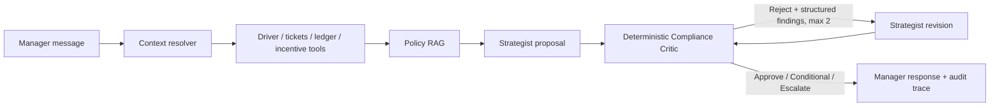

# Driver Retention Copilot

A production-minded **hybrid multi-agent system** for Driver Relationship Managers. It joins driver
profiles, support history, incentive candidates, policy clauses, and retention-ledger state; proposes
a response; validates it against deterministic guardrails; and automatically revises rejected plans.

> **Safety boundary:** recommendations only. The project never issues money, activates an incentive,
> or mutates a driver's account.

## Reviewer quick path

```bash
# 1. Install the reproducible local environment
python -m venv .venv
source .venv/bin/activate
python -m pip install -e ".[dev,pdf]"

# 2. See the complete business and technical flow without an API key
make reviewer-demo

# 3. Run the full quality gate
make quality
```

Then inspect:

- [Five-minute reviewer guide](docs/REVIEWER_GUIDE.md)
- [One-page technical design](docs/TECHNICAL_DESIGN.md)
- [Evaluation evidence](evaluations/README.md)
- [Production-readiness notes](docs/PRODUCTION_READINESS.md)

## Business value

For Driver Relationship Managers, the Copilot:

- reduces manual joining of profile, ticket, policy, incentive, and ledger data;
- produces consistent retention recommendations across managers;
- catches over-compensation, stacking, eligibility, and grounding failures before presentation;
- exposes assumptions and missing operational data instead of guessing;
- preserves driver context across follow-up questions;
- creates an auditable explanation of every recommendation and rejection.

## Requirement coverage

| Assignment requirement | Implementation | Evidence |
|---|---|---|
| Multi-Agent Orchestration | Strategist proposes/revises; independent Compliance Critic validates | `app/agents/`, `app/compliance/`, `app/orchestration/copilot.py` |
| Tool Use | Driver, ticket, ledger, incentive, and policy boundaries | `app/data/`, `app/integrations/`, `app/rag/` |
| RAG | Clause-aware retrieval, metadata ranking, mandatory global guardrails | `app/rag/policy_store.py`, `data/policy_chunks.json` |
| State & Memory | SQLite checkpoints for driver and issue continuity | `app/memory/sqlite_store.py`, `tests/test_memory.py` |
| Self-Correction | Structured Critic feedback drives bounded Strategist revision | `evaluations/`, `tests/test_orchestration.py` |
| Automated Evaluation | Unit, integration, contract, trace, grounding, and failure tests | `tests/`, `Makefile`, `.github/workflows/ci.yml` |
| UI stretch goal | Minimal Streamlit manager interface | `app/ui/streamlit_app.py` |
| Production readiness | Typed output, retry/fallback, fail-closed data, security checks | `app/llm/`, `docs/PRODUCTION_READINESS.md` |

## Architecture



This is a hybrid multi-agent design:

- The **Strategist** is a plan-generation agent. It can be deterministic or an optional
  schema-constrained LLM.
- The **Compliance Critic** is an independently implemented validation agent. It uses deterministic
  policy-as-code because monetary arithmetic and eligibility should not depend on model judgement.
- A rejected plan is returned to a separate Strategist revision pass with machine-readable findings.

Agent identity is defined by responsibility and contract, not by requiring a second language model.
The LLM may propose and revise; it cannot approve its own recommendation.

## Guardrails the model cannot bypass

The Critic does not trust proposal fields that determine whether a rule applies. It derives action
category, action type, immediate-credit status, and monthly-cap treatment from the Incentive Service
or a registered policy-action definition.

Examples of blocked attempts:

- relabel `INC-002` from `Airport` to `Engagement` to avoid the airport cap;
- mark a positive GBP action as excluded from the monthly cap;
- mark a credit as non-immediate to avoid the 24-hour stacking rule;
- cite a ticket or policy clause that was never retrieved;
- propose money without an available incentive or registered policy action.

See `app/compliance/classification.py`, `app/compliance/rules.py`, and
`tests/test_compliance_hardening.py`.

## What `make reviewer-demo` proves

The default no-API demonstration is intentionally explanatory so the repository can be reviewed
without a presentation. It walks through:

1. manager request and driver-context resolution;
2. profile, ticket, incentive, policy-RAG, and retention-ledger evidence;
3. an intentionally unsafe INC-002 proposal at £50;
4. deterministic rejection under named B.1 policy rules;
5. bounded correction to INC-001 at £25;
6. final approval with grounding and financial checks;
7. a follow-up question that reuses Maria and the previous issue context;
8. the inspectable agent/tool flow and recommendation-only safety boundary.

Additional modes:

```bash
make reviewer-demo-compact  # fast summary
make reviewer-demo-json     # full machine-readable result and raw timestamped trace
```

## Quick start

```bash
python -m venv .venv
source .venv/bin/activate          # Windows: .venv\Scripts\activate
python -m pip install --upgrade pip
python -m pip install -e ".[dev,pdf]"
cp .env.example .env
make reviewer-demo
```

For the locked Linux/Python 3.13 dependency set:

```bash
make install-locked
```

## Run the interfaces

### CLI

```bash
python -m app.cli chat \
  --driver-id D-LON-001 \
  --message "Maria waited 135 minutes for a 1.5km airport trip. What should we do?"
```

### API

```bash
make api
curl -s http://localhost:8000/health
curl -s -X POST http://localhost:8000/v1/chat \
  -H 'content-type: application/json' \
  -d '{
    "driver_id": "D-LON-001",
    "message": "Maria waited 135 minutes for a 1.5km airport trip. What should we do?"
  }'
```

### Optional UI

```bash
python -m pip install -e ".[ui]"
streamlit run app/ui/streamlit_app.py
```

## Execution modes

### Offline heuristic mode — default

```dotenv
STRATEGIST_PROVIDER=heuristic
```

Fully reproducible and requires no model credentials.

### API-backed LLM mode

```bash
python -m pip install -e ".[ai]"
export STRATEGIST_PROVIDER=openai
export OPENAI_API_KEY=...
export OPENAI_MODEL=<structured-output-model-available-to-your-account>
```

The provider must return a typed `RetentionPlan`. Bounded retries and deterministic fallback handle
transient failures. All compliance checks remain local and authoritative.

### No-cost manual LLM mode

Export the exact grounded prompt used by the Strategist:

```bash
make manual-export
```

Paste `manual_runs/maria/prompt.txt` into a chat model, save its JSON-only response as
`manual_runs/maria/response.json`, then run:

```bash
make manual-evaluate
```

Rejected responses generate a `revision-1/` prompt containing the Critic's structured findings.
`manual_runs/` is local working output and is intentionally ignored by Git.

### Test a different driver or scenario manually

The Maria example is only a reproducible reference scenario. Any driver present in
`data/driver_profiles.json` can be tested with a different manager message.

Using Make variables:

```bash
make manual-export \
  DRIVER_ID="D-LON-002" \
  MESSAGE="The driver reports repeated technical failures during the last week. What retention response is appropriate?" \
  MANUAL_DIR="manual_runs/technical_failure"
```

Or call the CLI directly:

```bash
python -m app.cli manual-export \
  --driver-id D-LON-002 \
  --message "The driver reports repeated technical failures during the last week. What retention response is appropriate?" \
  --output-dir manual_runs/technical_failure
```

The command creates:

```text
manual_runs/technical_failure/
├── prompt.txt
├── request.json
├── response.json
└── schema.json
```

1. Paste `prompt.txt` into a chat model.
2. Ask the model to return JSON only.
3. Save the response in `response.json`.
4. Evaluate it:

```bash
python -m app.cli manual-evaluate \
  --bundle-file manual_runs/technical_failure/request.json \
  --response-file manual_runs/technical_failure/response.json
```

The response is validated against the typed `RetentionPlan` contract and then passed
through the same deterministic Compliance Critic used by the application.

When the Critic rejects the plan, the command creates:

```text
manual_runs/technical_failure/revision-1/
├── prompt.txt
├── request.json
├── response.json
└── schema.json
```

Paste the revision prompt into the model, save the corrected JSON response, and run
`manual-evaluate` again using the files inside `revision-1/`.

### Run with an API-backed LLM Strategist

Install the optional model integration:

```bash
python -m pip install -e ".[ai]"
```

Configure the provider in `.env`:

```dotenv
STRATEGIST_PROVIDER=openai
OPENAI_API_KEY=your-key
OPENAI_MODEL=a-structured-output-model-available-to-your-account
```

Do not commit `.env`.

After configuration, use the same application interfaces:

```bash
# CLI
python -m app.cli chat \
  --driver-id D-LON-001 \
  --message "Maria waited 135 minutes for a 1.5km airport trip. What should we do?"

# FastAPI
make api
```

Then, in another terminal:

```bash
curl -s -X POST http://localhost:8000/v1/chat \
  -H 'content-type: application/json' \
  -d '{
    "driver_id": "D-LON-001",
    "message": "Maria waited 135 minutes for a 1.5km airport trip. What should we do?"
  }'
```

Only the Strategist changes from the deterministic implementation to the configured
LLM provider. Evidence retrieval, policy RAG, conversation memory, revision limits,
and deterministic Compliance Critic remain unchanged.

If the external model is temporarily unavailable, the bounded provider retry policy
runs first and the configured deterministic Strategist fallback preserves application
availability. No model response can approve its own recommendation or bypass the
Compliance Critic.


## Self-correction evidence

Generate the deterministic trace:

```bash
make trace
cat evaluations/maria_self_correction.json
```

Committed human-mediated LLM artifacts:

```text
evaluations/manual_self_correction/01_rejected.json
evaluations/manual_self_correction/revision_request.json
evaluations/manual_self_correction/02_corrected.json
```

They demonstrate:

```text
external model proposal
→ deterministic REJECT
→ revision prompt with policy feedback
→ corrected model proposal
→ deterministic APPROVE
```

## RAG and provenance

The policy corpus is small, so retrieval is intentionally transparent:

1. split policy text by business clause IDs such as `A.1` and `B.1`;
2. attach issue and loyalty-tier metadata;
3. rank issue clauses lexically;
4. always inject global financial guardrails;
5. return clause IDs with recommendations and Critic findings.

Structured records are retrieved exactly rather than embedded. Policy chunks preserve source document
name, source SHA-256, and PDF page number when a PDF is ingested. High-risk clauses are also promoted
to deterministic policy-as-code; RAG supplies context and citations, while code remains authoritative.

The demo uses `data/uk_driver_retention_recovery.md`, a normalized representation of the supplied
policy content. `PolicyStore` also accepts PDFs when the `pdf` extra is installed.

## State and memory

SQLite checkpoints store:

- conversation ID;
- active driver ID;
- previous issue type;
- recent messages;
- last plan;
- last Critic result.

Follow-up questions can reuse the driver and issue context, while source records are re-read for each
financial recommendation.

## Data and provenance

- `data/driver_profiles.json`, `data/support_tickets.csv`, and
  `data/incentive_service_mock.py` originate from the assignment package.
- `data/uk_driver_retention_recovery.md` is the normalized policy representation used for stable
  clause-level tests.
- `data/demo_retention_ledger.json` is synthetic and exists only to make cap and stacking checks
  reproducible. Missing ledger records remain unknown rather than defaulting to zero.

## Repository map

```text
app/
  agents/          Strategist interface, heuristic/LLM strategies, fallback
  compliance/      Authoritative classification, deterministic rules, Critic
  data/            Driver, ticket, and ledger repositories
  diagnostics/     Issue classification and measurable-fact extraction
  integrations/    Defensive Incentive Service adapter
  llm/             Provider-neutral structured-LLM boundary and OpenAI adapter
  memory/          SQLite conversation checkpoints
  orchestration/   Explicit bounded state machine and audit trace
  rag/             Policy ingestion, provenance, chunking, and retrieval
  ui/              Optional Streamlit manager interface
  manual_testing.py
                   Prompt export, validation, and revision bundles
data/              Supplied inputs, normalized policy, synthetic ledger
docs/              Reviewer guide, design, decisions, and production notes
evaluations/       Deterministic and human-mediated correction evidence
scripts/           Reviewer demo, policy ingestion, trace generation
tests/             Unit, integration, contract, hardening, and trace tests
```

## Quality

```bash
make lint       # Ruff lint and format check
make typecheck  # Strict mypy
make test       # Pytest + branch coverage, minimum 85%
make security   # Bandit + pip-audit
make quality    # Complete gate
```

Latest validated result for this upgrade:

- Ruff lint and formatting: passed;
- strict mypy: no issues in 38 source files;
- Bandit: no issues identified;
- pytest: **105 passed**;
- branch-aware coverage: **87.86%**, above the enforced 85% threshold;
- Python compilation: passed.

The apply script runs the same checks and also runs pip-audit in your network-enabled development
environment before you commit.

## Known limitations and scale-out path

The assignment data does not contain a production issuance ledger, complete trip telemetry, policy
effective dates, real-time demand, or authenticated service boundaries. The system exposes these gaps
rather than fabricating values.

At 20,000+ drivers:

| Current demonstration | Scaled service |
|---|---|
| JSON profiles | Driver Profile service or operational database |
| CSV tickets | Support/event service |
| SQLite memory | PostgreSQL or Redis |
| Local lexical policy index | Versioned, access-controlled hybrid retrieval service |
| Mock incentive adapter | Authenticated Incentive Service or MCP endpoint |
| Synchronous calls | Concurrent calls with deadlines, retries, and circuit breakers |
| Local traces | Central audit store, metrics, and human-review queue |

Further detail is in [Production Readiness](docs/PRODUCTION_READINESS.md).
