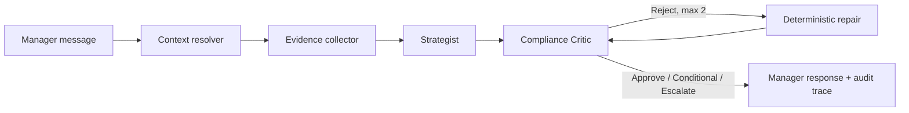

# Driver Retention Copilot

A production-minded take-home implementation of an auditable **Strategist / Compliance Critic**
workflow for Driver Relationship Managers.

The system retrieves structured driver data, support-ticket evidence, eligible incentive candidates,
and policy clauses; proposes a retention strategy; validates it with deterministic guardrails; and
performs a bounded self-correction pass when the Critic rejects a proposal.

> **Safety boundary:** this repository produces recommendations. It does not issue incentives or
> mutate a driver's account.

## Why this architecture



The LLM, when enabled, is allowed to **propose**. It is never the authority for financial caps,
eligibility, stacking, or escalation. Those rules are ordinary Python functions with stable rule IDs.
The default offline Strategist makes the submission reproducible without an API key.

## Highlights

- Actor/validator separation with bounded self-correction.
- Policy RAG using heading-aware clauses, metadata filters, lexical ranking, and mandatory global
  guardrail injection.
- Exact driver and ticket retrieval rather than embedding structured records.
- Persistent SQLite conversation state for follow-up questions.
- Fail-closed behaviour when monthly spend or 24-hour credit history is unavailable.
- Explicit handling of the supplied catalogue/policy mismatch: INC-001 is £25 in the mock, while
  Silver/Bronze airport recovery is capped at £15.
- Optional OpenAI structured-output Strategist with bounded retries and deterministic repair.
- FastAPI, Typer CLI, optional Streamlit UI, Docker, CI, security checks, and conventional Git flow.
- 71 automated tests covering domain rules, edge cases, tools, orchestration, memory, API contracts,
  and failure modes. Current measured coverage: **89%**.

## Quick start

```bash
python -m venv .venv
source .venv/bin/activate          # Windows: .venv\Scripts\activate
python -m pip install --upgrade pip
python -m pip install -e ".[dev,pdf]"
# For the validated Linux/Python 3.13 runtime set instead: make install-locked
cp .env.example .env
make test
make demo
```

Run the API:

```bash
make api
curl -s http://localhost:8000/health
curl -s -X POST http://localhost:8000/v1/chat \
  -H 'content-type: application/json' \
  -d '{
    "driver_id": "D-LON-001",
    "message": "Maria waited 135 minutes for a 1.5km airport trip. What should we do?"
  }'
```

Run the CLI:

```bash
python -m app.cli chat \
  --driver-id D-LON-001 \
  --message "Maria waited 135 minutes for a 1.5km airport trip. What should we do?"
```

Run the optional UI:

```bash
python -m pip install -e ".[ui]"
streamlit run app/ui/streamlit_app.py
```

## Required self-correction trace

```bash
python scripts/generate_eval_trace.py
cat evaluations/maria_self_correction.json
```

The initial injected candidate proposes `INC-002` at £50. The Critic rejects it for exceeding the
Gold cap and using a systemic-failure incentive without evidence. The Strategist repair replaces it
with `INC-001` at £25, then the Critic approves the second pass.

## Optional LLM mode

The default mode is deterministic:

```dotenv
STRATEGIST_PROVIDER=heuristic
```

To enable an external Strategist:

```bash
python -m pip install -e ".[ai]"
export STRATEGIST_PROVIDER=openai
export OPENAI_API_KEY=...
export OPENAI_MODEL=<model-available-to-your-account>
```

No model name is hard-coded because availability is deployment-specific. The external response must
validate as `RetentionPlan`; all compliance checks still run locally.

## Data and provenance

- `data/driver_profiles.json`, `data/support_tickets.csv`, and
  `data/incentive_service_mock.py` are copied verbatim from the assignment package.
- `data/uk_driver_retention_recovery.md` is a normalised text copy of the policy supplied in the
  prompt. The loader also supports a real PDF when the `pdf` extra is installed.
- `data/demo_retention_ledger.json` is clearly marked synthetic and exists only to make the Maria
  approve-after-repair trace reproducible. Missing drivers are treated as **unknown**, never zero.

## Repository map

```text
app/
  agents/          Strategist interfaces, offline strategy, optional OpenAI strategy
  compliance/      Pure guardrail rules and Compliance Critic
  data/            Driver, ticket, and ledger repositories
  diagnostics/     Issue classification and measurable-fact extraction
  integrations/    Defensive Incentive Service adapter
  memory/          SQLite conversation checkpoints
  orchestration/   Explicit bounded state machine
  rag/             Policy ingestion, chunking, and retrieval
  ui/              Optional Streamlit manager interface
data/               Supplied inputs, normalised policy, synthetic demo ledger
evaluations/        Scenario catalogue and generated self-correction trace
scripts/            Policy ingestion and trace generation
 tests/              Unit, integration, contract, and failure-mode tests
```

## Quality commands

```bash
make lint       # Ruff lint and format check
make typecheck  # Strict mypy
make test       # Pytest + branch coverage, minimum 85%
make security   # Bandit + pip-audit
make quality    # All checks
```

CI runs on Python 3.11, 3.12, and 3.13. The lock files capture the validated Linux/Python 3.13 environment; `pyproject.toml` remains the cross-version dependency contract. See [Git workflow](docs/GIT_WORKFLOW.md),
[one-page design](docs/TECHNICAL_DESIGN.md), and
[production-readiness notes](docs/PRODUCTION_READINESS.md).

## Known limitations

The assignment data has no authoritative issuance ledger, complete trip telemetry, policy effective
dates, or demand diagnostics. The code exposes these gaps rather than guessing. The lexical policy
retriever is intentionally proportionate to a seven-clause corpus; a larger policy estate should add
versioned embeddings, access control, and retrieval evaluation. See the production-readiness document
for the scale-out path to 20,000+ drivers.
